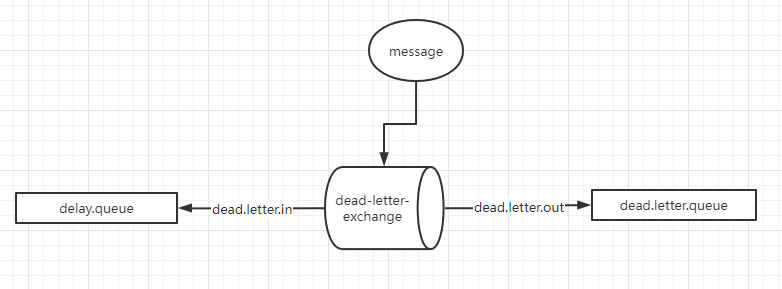

# 整合SpringBoot简单案例

## 使用AmqpAdmin创建队列交换机

```java
@Autowired
private AmqpAdmin amqpAdmin;
```

引入AmqpAdmin类，可以使用里面的Api创建队列等，这个一般用于创建临时队列。

## 使用RedisTemplate发送消息

```java
@Autowired
private RabbitTemplate rabbitTemplate;
```

这个用法很简单，不多赘述

## 使用Bean注入的方式创建队列等

注意注入的Type一定不要错，导的包很容易错。这里我演示了死信队列的操作。

## 延迟队列、死信队列

死信队列是为了实现延迟队列而存在的，这也是RabbitMq的特色功能之一。



首先消息进来，通过指定交换机和路由进入到delay-queue（延时队列，设置了TTL）

为消息TTL之后配置交换机和路由，这个交换机可以和之前的交换机共用，但是路由一定要到死信队列。

死信队列其实就是一般的队列，用来接收延迟队列过期的消息，然后业务监听正常消费就行。