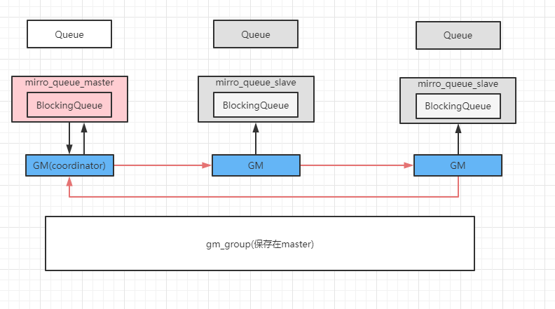

# RabbitMq面试题

## 1、RabbitMq镜像队列原理

镜像队列源自于集群模式，集群模式不能保证高可用，所以就要使用镜像队列。



GM负责消息广播，所有GM组成gm_group，形成链表结构，负责监听相邻节点状态，以及传递消息到相邻节点，master的GM收到消息时代表消息同步完成。

mirror_queue_master/salve负责消息的处理，操作BlockingQueue，Queue负责AMQP协议

流程：消息由Master进入，存放在BlockingQueue中进入GM，以此路过所有GM，GM将消息同步到对应的BlockingQueue中，当消息重新回到master的GM时代表消息同步完成

## 2、死信队列、延迟队列

1. 消息被消费方否定确认，使用`channel.basicNack`或`channel.basicReject`，并且此时`requeue`属性被设置为false。
2. 消息在队列的存活时间超过设置的TTL时间。
3. 消息队列的消息数量已经超过最大队列长度。

那么这个消息会变成死信消息。如果配置了死信队列信息，那么该消息会被丢进死信队列中，如果没有配置，则该消息将会被丢弃。

为每个需要使用死信的业务配置一个死信交换机，同一个项目的死信交换机可以共用一个，然后为每个业务队列非配单独的routing key，死信队列只不过是绑定在死信交换机上的队列，死信交换机也不是特殊的交换机，只不过是一个接收死信消息的交换机，所以可以使Direct、Fanout、Topic。

如果一个消息设置了TTL属性或者进入了设置TTL属性的队列，那么这个消息如果在TTL内未被消费，就会成为死信。

这个地方有个细节，就是消息设置TTL和队列设置TTL的区别，一个是软丢弃，一个是硬丢弃，详见Redis中的抛弃策略。

```java
arguments.put("x-dead-letter-exchange", "dlx.exchange");
channel.queueDeclare(queueName, true, false, false, arguments);
channel.queueBind(queueName, exchangeName, routingKey);
channel.exchangeDeclare("dlx.exchange", "topic", true, false, null);
channel.queueDeclare("dlx.queue", true, false, false, null);
channel.queueBind("dlx.queue", "dlx.exchange", "#");
```

## 3、RabbitMq直连队列

一般使用RabbitMq时，都会通过Exchange去连接Queue而不是生产者消费者直接连接这个Queue，我们可以直接连接Queue吗？

可以，但是这样丧失了灵活性。

我们让生产者和消费者使用相同的参数声明队列。重复声明不会改变队列。利用这个特点，我们就可以直连队列。

```java
// 生产者
channel.queueDeclare(QUEUE_NAME, false, false, false, null);
for (int i = 0; i < NUM; i++) {
  String msg = "xxxx";
  channel.basicPublish("", QUEUE_NAME, null, msg.getBytes());
}

// 消费者
channel.queueDeclare(QUEUE_NAME, false, false, false, null);
QueueingConsumer consumer = new QueueiingConsumer(channel);
channel.basicConsume(QUEUE_NAME, true, consumer);
while (true) {
  QueueingConsumer.Delivery delivery = consumer.nextDelivery();
  String msg = new String(delivery.getBody());
  // 使用消息
}
```